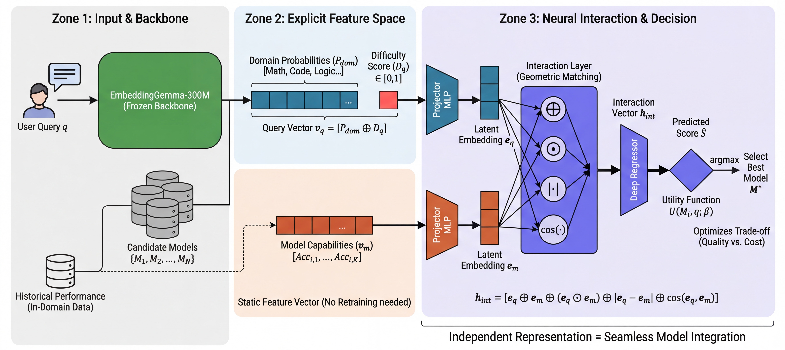

# Adaptive Routing for Specialized Large Language Models



## This repo contains the code for paper "Adaptive Routing for Specialized Large Language Models"

### Baseline
We use Route_LLM(https://github.com/lm-sys/RouteLLM) as our baseline 
Please first fork and clone RouteLLM in order to use following files
- routellm_baseline.py: Using this file to generate Baseline result 
- binary_router.py: Using this file to analyze the Baseline result

### Data Preparation  
- calculate_query_difficulty.py: Using this file to generate query difficulty score for Query Vector
- extract_openllm_leaderboard_data.py: Using this file to collect model performance in open LLM leaderboard 
- extract_dataset_samples.py: Using this file to generate final ID and OOD dataset for downstream task

### Query Vector 
- predict_feature_vectors.py: Using this file to generate query feature vector 
- train.py: This file contains how to fine-tune Gemma for our Query vector 
- train.ipynb: Illustrates the process of query vector generation.
### Model Vector

- update_models_info.py: Using this file to generate needed model vector 

### Heuristic Difficulty Penalty


- multi_router.py: Using this file to perform Heuristic Difficulty Penalty(HDP) as described in paper 

### Neural Interaction Router
- router.ipynb: Using this file to train NIR model and save weight 
- NIR_Prediction: This file contains the function to do the NIR prediction 
- NIR_DEMO.ipynb: This file illustrate how to perform NIR_Prediction

#### Paper related 
- RouterModel.ipynb: This file is used in get route performance under different user-preference parameter β(alpha in code)
- Eval.ipynb: This file is used to generate the Result for NIR model which presented in paper 

## Project Structure Overview

```
AR-LLM/
├── utils/                           # Utility modules
│   ├── __init__.py
│   ├── model.py                     # Model definitions (BERTBinaryClassifier, MultiClassClassifier, RouterNN)
│   └── utils.py                     # Dataset classes, data loading, and checkpoint utilities
│
├── data/                            # Data directories (download from Google Drive link below)
│   ├── model_data/                  # Model performance data, query difficulty, extracted samples
│   ├── feature_vectors/             # Generated query feature vectors (ID/OOD)
│   └── baseline_scores/             # Baseline router scores (BERT, MF, etc.)
│
├── model_checkpoints/               # Trained model checkpoints (download from Google Drive)
│   ├── embeddinggemma_multi_class_classifier/
│   ├── embeddinggemma_difficulty_predictor/
│   └── best_router_model.pth
│
├── Data Preparation Scripts
│   ├── calculate_query_difficulty.py        # Calculate query difficulty scores
│   ├── extract_openllm_leaderboard_data.py # Extract model performance from Open LLM leaderboard
│   └── extract_dataset_samples.py         # Generate ID and OOD datasets
│
├── Query & Model Vector Generation
│   ├── predict_feature_vectors.py           # Generate query feature vectors
│   ├── train.py                             # Train EmbeddingGemma for query vectors
│   └── update_models_info.py                # Generate model feature vectors
│
├── Routing Methods
│   ├── multi_router.py                      # Heuristic Difficulty Penalty (HDP) router
│   ├── NIR_Prediction.py                     # Neural Interaction Router (NIR) prediction
│   ├── routellm_baseline.py                  # RouteLLM baseline implementation
│   └── binary_router.py                     # Binary routing analysis and comparison
│
└── Notebooks/                        # Jupyter notebooks for training and evaluation
    ├── train.ipynb                   # Query vector generation training process
    ├── router.ipynb                  # NIR model training
    ├── RouterModel.ipynb             # Router performance evaluation across β values
    ├── NIR_DEMO.ipynb                # NIR prediction demonstration
    └── Eval.ipynb                    # Final evaluation and comparison with baselines
```

### Due to storage limitation in Github, all data, model checkpoint and other large files can be found [here](https://drive.google.com/drive/folders/1HttlWgavhk9H8aLXzzlk7g1XlcSL4nN4?usp=drive_link)
